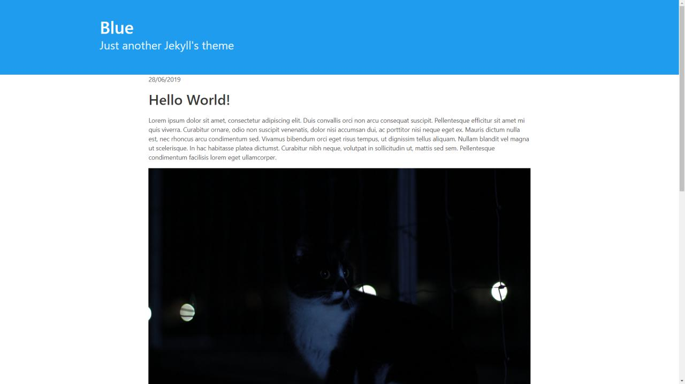

# Blue

> Minimalist Jekyll theme (based on Bulma)

Work in progress!

[DEMO](https://jsalvador.me/blue)

## How to install

1. Fork this repository
2. Rename your fork as *your-username*.github.io
3. Edit the variables on `_config.yml` to make them yours
4. Replace the content of `_posts/` with your own content
5. Enjoy and submit me any issue or improvement!

## Screenshot

## Licencse

MIT License